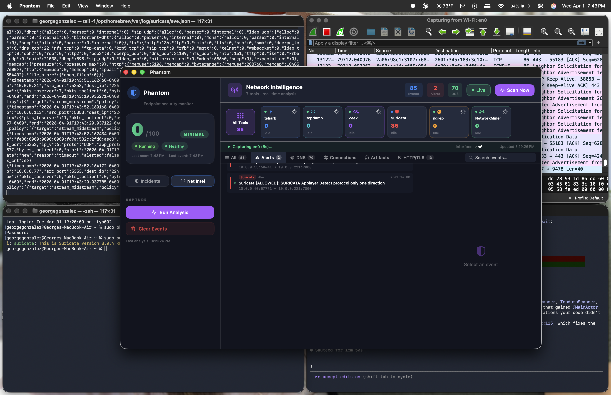
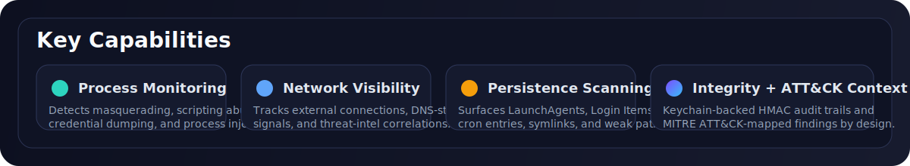
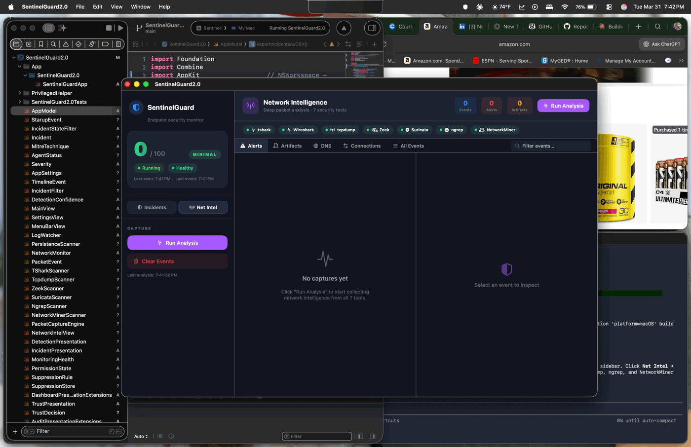
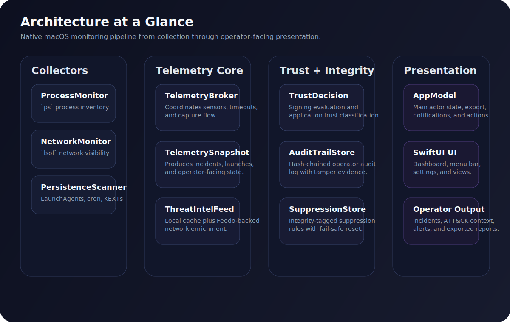
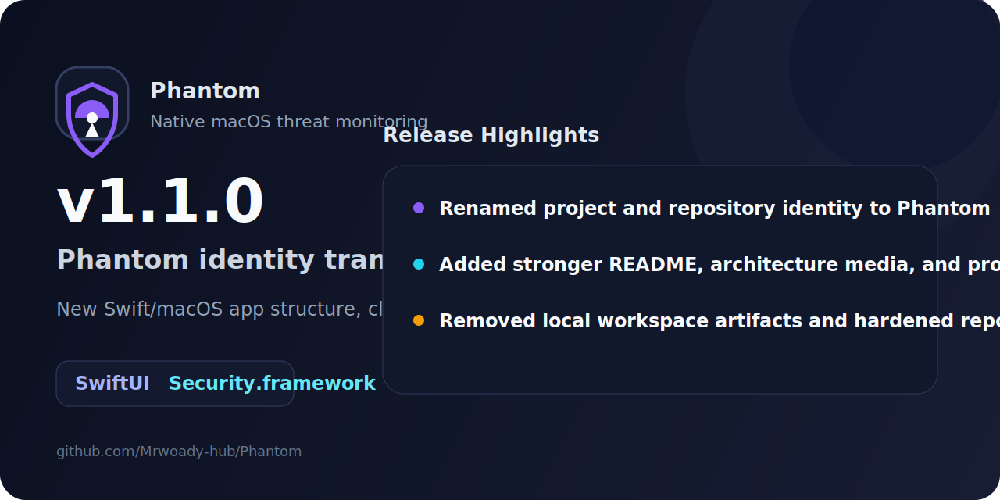

# Phantom

<p align="center">
  
</p>

Native macOS threat monitoring built in Swift.

[](https://github.com/Mrwoady-hub/Phantom/actions/workflows/ci.yml)





Phantom is a menu bar security monitor for macOS that focuses on practical local visibility:

- suspicious process execution
- external network activity
- persistence changes
- MITRE ATT&CK-mapped findings
- tamper-evident audit logging

It is designed to stay native to the Apple stack: Swift, SwiftUI, Security.framework, Keychain-backed integrity checks, and a small operational footprint.

## Why Phantom

Most security tooling for macOS is either too heavy, too opaque, or too dependent on external services. Phantom takes a different approach:

- native macOS app architecture
- no third-party runtime dependencies
- understandable detection logic
- security-first local storage
- portfolio-grade codebase with production-oriented structure

## What It Monitors

| Surface | Implementation | Examples |
|---|---|---|
| Process | `ps -axo pid,ppid,user,command` | masquerading, scripting abuse, credential dumping, process injection |
| Network | `lsof -nP -iTCP -iUDP` | suspicious outbound connections, C2-style behavior, threat-intel matches |
| Persistence | LaunchAgents, LaunchDaemons, Login Items, cron, KEXTs, app scripts | unsigned items, symlinks, user-writable launch points |

## Scan Flow



## Security Model

Phantom treats integrity as a first-class requirement.

- Audit events are written as a hash-chained log.
- Audit and suppression data are HMAC-protected with a Keychain-backed secret.
- Threat intel is cached locally with restrictive file permissions.
- Detection logic prefers explicit system behavior over fragile heuristics.

This is not a kernel EDR. It is a native user-space monitor intended for visibility, experimentation, and iterative hardening.

## Detection Coverage

Current coverage includes:

- `T1059` Command and Scripting Interpreter
- `T1071` Application Layer Protocol
- `T1105` Ingress Tool Transfer
- `T1547` Boot or Logon Autostart Execution
- `T1003` OS Credential Dumping
- `T1036` Masquerading
- `T1055` Process Injection
- `T1082` System Information Discovery
- `T1562` Impair Defenses

## Architecture

Core areas in the current codebase:

- `AppModel.swift`: main application state and operator actions
- `TelemetryBroker.swift`: sensor orchestration and timeout control
- `TelemetrySnapshot.swift`: incident generation pipeline
- `ProcessMonitor.swift`, `NetworkMonitor.swift`, `PersistenceScanner.swift`: collection layer
- `TrustDecision.swift`: signing and trust classification
- `AuditTrailStore.swift`, `SuppressionStore.swift`, `KeychainHMAC.swift`: integrity layer
- `ThreatIntelFeed.swift`: local threat-intel feed management
- `PhantomTests/`: unit coverage for audit, detection, risk, MITRE mapping, and intel behavior



## Requirements

- macOS 13 or later
- Xcode 15 or later

## Build

```bash
git clone git@github.com:Mrwoady-hub/Phantom.git
cd Phantom
open Phantom.xcodeproj
```

Or build from Terminal:

```bash
xcodebuild -project Phantom.xcodeproj \
  -scheme Phantom \
  -configuration Debug \
  build
```

## Test

```bash
xcodebuild -project Phantom.xcodeproj \
  -scheme PhantomTests \
  -destination "platform=macOS" \
  test
```

## Current State

Phantom is under active development. The repository now reflects the product rename from the earlier SentinelGuard identity and includes the current Swift/macOS application structure.

Near-term priorities:

- privileged helper hardening
- deeper network telemetry
- release packaging and notarization
- continued false-positive reduction

## Roadmap

- [ ] privileged helper integration for elevated collection paths
- [ ] deeper Endpoint Security framework exploration
- [ ] user-defined rule tuning
- [ ] signed release pipeline and notarized builds

## Release Notes

The current transition release notes are here:

- 
- [RELEASE_NOTES_v1.1.0.md](RELEASE_NOTES_v1.1.0.md)

## License

MIT
